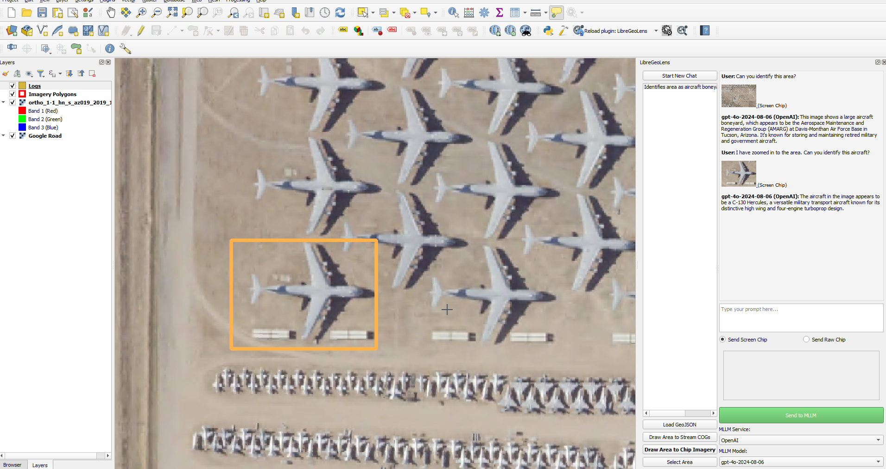

# LibreGeoLens

A QGIS plugin for experimenting with Multimodal Large Language Models (MLLMs) to analyze remote sensing imagery.

## Demo (click on the image)

[](./resources/media/demo.gif)

## Key Features

- Chat with an MLLM about georeferenced imagery.
- Choose from different MLLM services and models.
- Work with local and/or remote imagery.
- Draw areas to select and extract image chips to send to the MLLM.
- Keep track of the chips and the interactions with the MLLM as GeoJSON features.

## Prerequisites

### QGIS Installation

1. Navigate to the [QGIS Download Page](https://qgis.org/download/)
2. Use the Online (OSGeo4W) Installer, "Express Install" when prompted
3. Select https://download.osgeo.ord when prompted for a download site
4. When prompted with a checkbox list of four items to download, only QGIS (the first option) is necessary

### MLLM Services

Right now the plugin only supports [OpenAI](https://platform.openai.com/docs/quickstart) (paid)
and [Groq](https://console.groq.com/docs/quickstart) (free), and you need an API key to use either of them. Open QGIS and go to
`Settings` -> `Options` -> `System` -> scroll down to `Environment`, toggle if needed, click on the `Use custom variables` checkbox,
and add at least one of the following environment variables:
- Variable: `OPENAI_API_KEY` - Value: your OpenAI API key.
- Variable: `GROQ_API_KEY` - Value: your Groq API key.

Make sure to restart QGIS so that these changes take effect.

## Quickstart

1. Make sure you have followed the instructions for the MLLM services above.
2. Go to `Plugins` > `Manage and Install Plugins...` -> `Settings` -> `Show also Experimental Plugins` -> `All` ->
   search for "LibreGeoLens", and click `Install Experimental Plugin`. Restart QGIS if needed.
3. Load a basemap layer. See [this](https://www.giscourse.com/quickmapservices-plugin-an-easy-way-to-add-basemaps-in-qgis/) for an example of one way to do it. Google Road is a nice one to start with.
4. Click on the  icon on the top right to start 
   the plugin, which will be docked to your right.
5. Click on the `Load GeoJSON` button, choose `Use Demo Resources` and click `Ok`.
6. You will see three red polygons over the US. Zoom into one of them, click on the `Draw Area to Stream COGs` button,
   and draw an area that intersects with one of them (click once on the map to start drawing and a second time to finish). 
   The COG will be displayed.
7. Zoom into the image and find something you want to chat with the MLLM about.
8. Click on the `Draw Area to Chip Imagery` button, draw the area the same way you did before,
   and you'll see the chip above the `Send to MLLM` button.
9. Type a prompt and click on the `Send to MLLM` button to start a conversation.

### Troubleshooting Python Dependencies

The plugin also needs external Python dependencies. It will try to install them automatically, but if it fails, you will need to do so manually,
by downloading [requirements.txt](libre_geo_lens/requirements.txt) and following the instructions below.

NOTE: If while trying to install you get an error saying `pip not found` or similar, you will need to install pip first.

In Windows, you can use the OSGeo4W shell and run
```shell
python -m pip install -r requirements.txt
```
If this fails, try the instructions below.

In macOS/Linux or in Windows if the above failed, you need to find the Python that QGIS is using.
In order to do so, open QGIS, open the Python Console 
(Ctrl+Alt+P) and do
```python
from qgis.PyQt.QtCore import QStandardPaths
QStandardPaths.findExecutable("python")
# example outputs:
# C:/PROGRA~1/QGIS33~1.15/bin/python.exe (Windows)
# /usr/bin/python  (Linux)
```

and then in Powershell or in the terminal, run
```shell
<output_from_above> -m pip install -r requirements.txt
```

It could happen that the output of `QStandardPaths.findExecutable("python")` is an empty string. If so, try the following:
```python
import sys
sys.executable
# example output:
# /Applications/QGIS-LTR.app/Contents/MacOS/QGIS  (macOS)
```

and then try to find the Python you need to use. In the example above, it was `/Applications/QGIS-LTR.app/Contents/MacOS/bin/python3`.

### COG Streaming (optional)

Since you can use the plugin with your local imagery, this is optional. 
We also provide a few demo images hosted in S3 so that you can try out the plugin even if you don't have any imagery.
So feel free to skip this section for now.

However, we've found it convenient to use the COG streaming functionality that QGIS provides,
and so we've added features to the plugin accordingly. We've only tested this over HTTPS hosted in a public AWS S3 bucket,
as well as with a private S3 bucket, but it should work with other clouds as well, as long as you set the right environment variables.
For S3, you need to add the following environment variables (the same way we did above for the MLLM services):
- Variable: `AWS_ACCESS_KEY_ID` - Value: See [here](https://docs.aws.amazon.com/IAM/latest/UserGuide/id_credentials_access-keys.html).
- Variable: `AWS_SECRET_ACCESS_KEY` - Value: idem as above.
- Variable: `AWS_REQUEST_PAYER` - Value: `requester`.

Make sure to restart QGIS so that these changes take effect.

Finally, you need COGs hosted either publicly or in private cloud storage, and a GeoJSON file that the plugin can load.

<details>

<summary>Expand to see the GeoJSON format.</summary>

```json
{
    "type": "FeatureCollection",
    "features": [
        {
            "type": "Feature",
            "geometry": {
                "type": "Polygon",
                "coordinates": [
                    [
                        <outline_coords_in_epsg_4326>
                    ]
                ]
            },
            "properties": {
                "remote_path": "s3://path/to/cog.tif"  (for example, could also start with "https" or other cloud)
            }
        },
        ...
    ]
}
```

</details>

Also look at [this](https://libre-geo-lens.s3.us-east-1.amazonaws.com/demo/demo_imagery.geojson) for another example.

You can use [create_image_outlines_geojson.py](utils/create_image_outlines_geojson.py)
to create a `.geojson` from your COGs in S3. Just run it like this:
```shell
python create_image_outlines_geojson.py --s3_directories s3://bucket1/path/to/dir1/ s3://bucket2/path/to/dir2/ 
```
The script will find all the COGs nested inside `--s3_directories` and create the GeoJSON with their outlines and their S3 paths.

## More Features

- Select `Send Screen Chip` to capture the screen display, or `Send Raw Chips` to extract the actual pixels from the image layer.
- You can send multiple chips (or no chips).
- After clicking on the `Send to MLLM` button, each chip is saved as a GeoJSON feature and displayed as an orange rectangle.
- Click on the `Select Area` button and then click on an orange GeoJSON feature to see where it was used in the chat/s.
- If more than one feature contains the selection point, a dropdown will allow you to choose which feature you want to select.
- Click on a chip in the chat to select it, and flash its GeoJSON feature (and zoom to it if not in view).
- Click on a chip above the `Send to MLLM` button to also flash and zoom to if not in view.
- Double-click on a chip above the `Send to MLLM` to open it with your machine's image viewer.
- You can choose between different MLLM services and models by using the dropdowns below the `Send to MLLM` button.
- You can manually load local GeoTIFFs / COGs instead of using streaming COGs.
- You can stream your own data. See the [COG Streaming](#cog-streaming-optional) subsection
  above for more details. GeoJSONs can be loaded locally or from S3 with the `Load GeoJSON` button.
- Note that every time you load a GeoJSON for streaming, all the layers related to the previous GeoJSON will be removed.
- Click on `Delete Chat` to delete the selected chat. It will ask if you want to also delete features/chips if only associated with this chat.
- Click on `Export Chat` to generate a self-contained html displaying the chat, including the chips used and a `.geojson` subset with the chip features.
- Click on `Open Logs Directory` to open the directory where the local logs are saved.
- Click on `Help` for a quick usage guide.
- Additional optional settings  :
    - `Default GeoJSON S3 Directory`: the default directory in S3 where the `.geojson` files will be searched for.
       You can modify the actual directory to be used every time you click on the `Load GeoJSON` button.
    - `S3 Logs Directory`: the directory in S3 where you want to back up your logs.
       You can leave it blank if you don't want to back them up automatically.
    - `Local Logs Directory`: the local directory where you want to save your logs. You can use the `Browse` button for this one.
       If you don't set it, a new directory called `LibreGeoLensLogs` will be created in your home directory and the logs will be saved here.

## Installation From Source (For Devs)

1. Clone this repo and follow the [Prerequisites](#Prerequisites) section above.
2. If you have already installed this plugin through the QGIS Python Plugins Repository, uninstall it first.
3. Find your QGIS local plugins directory and symlink [libre_geo_lens](libre_geo_lens) (the inner directory).
   NOTE: If it's your first time using a QGIS plugin, you'll need to create the `plugins` directory first (see below).

In Windows, you can run Command Prompt as an Administrator and do:
```
mklink /D "C:\Users\<UserName>\AppData\Roaming\QGIS\QGIS3\profiles\default\python\plugins\libre_geo_lens" "C:\local\path\to\LibreGeoLens\libre_geo_lens"
```
In macOS, you can do:
```
ln -s /absolute/local/path/to/LibreGeoLens/libre_geo_lens ~/Library/Application\ Support/QGIS/QGIS3/profiles/default/python/plugins/libre_geo_lens
```
In Linux, you can do:
```
ln -s /absolute/local/path/to/LibreGeoLens/libre_geo_lens ~/.local/share/QGIS/QGIS3/profiles/default/python/plugins/libre_geo_lens
```

4. Open QGIS, go to `Plugins` -> `Manage and Install Plugins...` -> `Settings` -> `Show also Experimental Plugins` ->
   `Installed Plugins` -> click on the checkbox for `LibreGeoLensDev`.
5. Now this plugin should appear when you click on Plugins and also the icons should show up on the right.
   If the plugin still doesn't appear, close and re-open QGIS and try again.
6. In order to reload the plugin after the code in this repo is modified, you can install and use the *Plugin Reloader* plugin.
7. If you change the icons or use new resources, run `pyrcc5 -o resources.py resources.qrc`.

## Publishing

See [here](https://plugins.qgis.org/publish/). Copy [LICENSE](LICENSE) into [libre_geo_lens](libre_geo_lens),
make sure to remove the __pycache__, zip it, and upload it.
